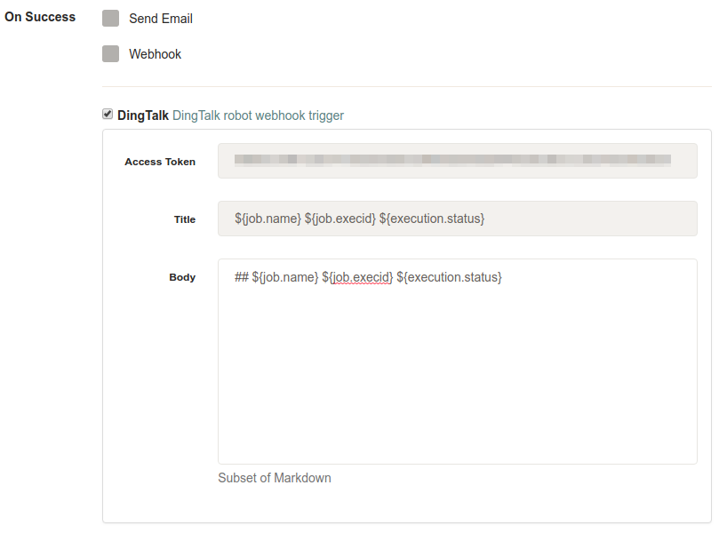

## Rundeck DingTalk Notification Plugin

[DingTalk](https://www.dingtalk.com/) Notification Plugin for [Rundeck](https://www.rundeck.com/open-source).

This plugin uses markdown as message type. For supported markdown syntax, please refer to [official docs](https://open-doc.dingtalk.com/microapp/serverapi2/qf2nxq#a-nameytovydamarkdown%E7%B1%BB%E5%9E%8B)

## Build and Deploy

 * Run `gradle jar`
 * Copy `build/libs/rundeck-dingtalk-notification-*.jar` to `RUNDECK_HOME/libexc`
 * Restart rundeckd service `sudo systemctl restart rundeckd`

## Settings

